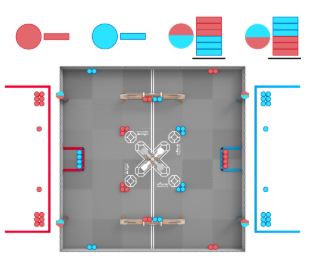
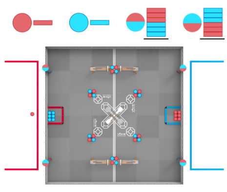

# Game Manual

---

## Tournament Scoring

### Field Layout

---

### Tournament Scoring Table

| Scoring Item                                           | Points        |
|--------------------------------------------------------|--------------|
| Each Block (Scored in a Goal)                          | 3 points     |
| Controlled Zone Long (CZL) Bonus                       | 10 points    |
| Controlled Center Upper (CCU) Bonus                    | 8 points     |
| Controlled Center Lower (CCL) Bonus                    | 6 points     |
| One Alliance Robot Parked                               | 8 points     |
| Two Alliance Robots Parked                              | 30 points    |
| Autonomous Bonus (for higher auton-period score)       | 10 points    |

### Controlled Zone Bonuses

- **Controlled Zone Long (CZL) Bonus:** 10 pts  
  For having the majority of blocks within the space between the white tape lines.

- **Controlled Center Upper (CCU) Bonus:** 8 pts  
  For having the majority of blocks within the entirety of the center’s upper goal.

- **Controlled Center Lower (CCL) Bonus:** 6 pts  
  For having the majority of blocks within the entirety of the center’s lower goal.

---

### Parking Bonuses

- **One Parking Bonus:** 8 pts  
- **Two Parking Bonus:** 30 pts  

> The Robot is only contacting the Alliance-colored Park Zone.  
> The Robot is partially within the vertical space of the Park Zone.

---

### Autonomous (Auton) Bonus

- **Auton Bonus:** 10 pts  
  All bonuses and scoring, EXCEPT parking bonus, are included in this bonus calculation.

---

### Auton Win Point

**Additional Win:** Within the 15-second auton period, bots must complete the following:

- At least seven alliance blocks are scored.  
- At least three different goals have one scored alliance block.  
- At least three alliance blocks have been removed from the alliance’s match load zone.  
- Neither robot is contacting the park zone barrier.

---

## Skills Scoring

### Field Layout

---

### Skills Scoring Table

| Scoring Action | Points |
|----------------|---------|
| Each Block Scored in a Goal | 1 Point |
| Each Filled Control Zone in a Large Goal | 3 Points |
| Each Filled Control Zone in a Center Goal | 10 Points |
| Each Cleared Park Zone | 5 Points |
| Each Cleared Loader | 5 Points |
| Parked Robot | 15 Points |

---

### Inventory

- **61 blocks total:** 30 blue & 31 red  
- The following of the **31 red** *not including the matchload*:
  - 18 blocks on field  
  - 12 blocks in loaders  

---

### Unique Rules

- Given there is no winner or loser, violations’ severities are considered only if the violation  
  **positively affected the team’s score.**

- `<GG>`, `<SG>`, and `<RSC>` rule violations are considered **within the match only**,  
  not the entire event.

#### Rule Categories

- **<GG>** — *General Game rules*, e.g.  
  don’t destroy or entangle robots or the field.  

- **<SG>** — *Specific Game rules*, i.e. how to interact with the field and game.  

- **<RSC>** — *Robot Skills Challenge rules*, i.e. how Skills are performed.

---

### Ending Robot Skills

A team can **end Robot Skills early**, but must **declare this before the match**,  
and it **will not affect the team’s score.**

### Additional Skills Scoring Details

- **Filled Control Zone Long Goal Bonus:** 5 pts  
  The control zone of a long goal is **completely filled** with the maximum amount of the *same-colored* block.

- **Filled Control Zone Center Goal Bonus:** 10 pts  
  The entirety of a center goal is **completely filled** with the maximum amount of the *same‐colored* block.

- **Cleared Park Zone Bonus:** 5 pts  
  No blocks are touching the floor inside the parking zone at the end of the match.

- **Cleared Loader Bonus:** 5 pts  
  No blocks are inside a loader at the end of the match.

- **Parked Robot Bonus:** 15 pts  
  Following the same <SC4> requirements, the Robot must be within the **Red Alliance parking zone**.

## Important Notes

---

### Strategy

Although there is a defined no-possession limit, it’s been specifically implied that  
they could implement a possession limit if excessive hoarding of game objects becomes the meta.

Same goes for goal defense — in order to prevent similar strategies as seen from *High Stakes*,  
they could create a similar goal protection rule.

---

### Robot

- License plates should be on **two opposing sides** of the bot.  
- Custom license plates must be made from legal VEX parts  
  - e.g., flat base plates.  
- Motor wattage is limited to any combination of **11W & 5.5W** motors to total **at most 88W**.  
- The radio can’t have **metal surrounding** the radio symbol or LEDs.  
- There is a maximum of **12 individual non-shatter plastics**, each **4”×8”×0.070”**.  
- No 3D printed functional or non-functional part.  
- Horizontal and vertical expansions have no directional limits  
  but must fit within a **22”×22”×22”** cube.
