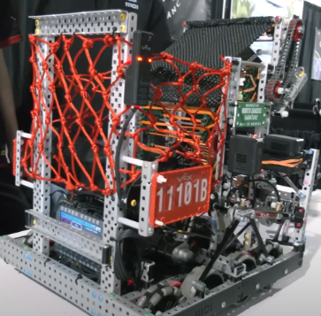
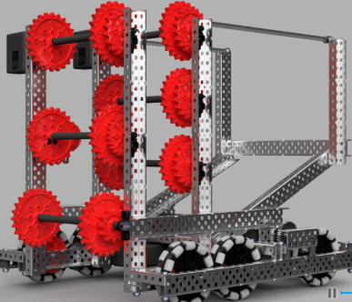
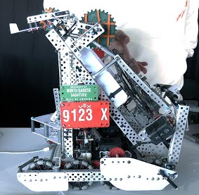
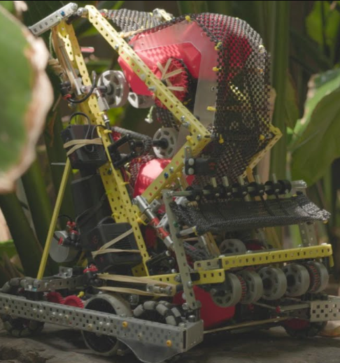

# Brainstorming Document  

---

## 1. Hoard Bots

### Concept Overview

**Hoard Bots** are designed to carry **12 or more blocks simultaneously**, enabling large, decisive plays that can **completely replace all the blocks** in a long goal.  
These designs focus on **volume and control**, seeking to dominate field presence through block replacement.

---

### Reference Images

| Prototype | Description |
|:----------:|-------------|
|  | **Team 11101B** — Hoard bot example with high-capacity design and cool red net. |
|  | **Team 47779J** — Hoard bot concept with rough frame design |

---

### Design Intent

- Prioritize **high-capacity block storage** over speed.  
- **Replace long goals entirely** in one or two trips.  
- **Control the game tempo** by removing opponent blocks and securing long-term scoring.

---

### Key Features

| Feature | Description |
|----------|--------------|
| **High-Capacity Storage** | Holds 12+ blocks for total goal domination. |
| **Powerful Intake & Conveyor** | Rapid collection and release system. |
| **Sturdy Frame** | Reinforced to manage high weight loads. |
| **Mass Block Dumping** | Can unload full capacity quickly in long goals. |

---

### Strategic Analysis

#### Advantages
- Excellent **field control** when dominating key goals.  
- Strong **autonomous potential** for consistent scoring.  
- Can **swing matches** by clearing opponents’ blocks.

#### Challenges
- **Slower cycles**, less agile under defense pressure.  
- Promotes **selfish playstyle** if not coordinated with partner bot.  
- High weight = less efficient parking and movement.  

---

### Meta & Balance Notes

If this design becomes dominant, referees or the Game Committee may **enforce possession limits** or **adjust rules** to prevent over-centralization — similar to the “High Stakes” precedent.

---

### Initial Build Ideas

| Area | Possible Operation |
|-------|----------------------|
| Intake | Band barrels or Flex wheel intake |
| Storage | Mesh or polycarbonate containment. |
| Drive | 66w blue 450rpm. 3.25 or 2.75? Traction wheels for grip|
| Weight Balance | Lower center of gravity for improved turns. |

---

### Next Steps

1. Model high-capacity conveyor and hopper in CAD.  
2. Prototype loading efficiency using mock frames.  
3. Compare speed vs. Fast Cycle prototypes under load.

---

## 2. Fast Cycle Bots

### Concept Overview

**Fast Cycle Bots** are lightweight robots that hold **≤ 6 blocks** and focus on **high-speed, repeatable cycles** from the **match loader to scoring zones**.  
Instead of hoarding, these designs rely on **constant throughput** and **agile maneuvering** to outpace slower robots.

---

### Reference Images

| Prototype | Description |
|:----------:|-------------|
|  | **Team 9123X** — Fast cycle bot built for rapid match-loader runs; lightweight design emphasizing acceleration and precision alignment. |
|  | **Team 16610A** — Compact cycle bot focusing on speed and control; optimized for quick scoring loops with minimal mechanical delay. |

### Design Intent

- Maximize **cycle rate** (time from pickup → score → return).  
- Prioritize **mobility, alignment accuracy, and reload efficiency**.  
- Optimize **autonomous and driver control** consistency over raw capacity.

---

### Key Features

| Feature | Description |
|----------|--------------|
| **Compact Frame** | Lightweight build for faster acceleration and quick turns. |
| **Efficient Intake** | One-pass pickup system; minimizes jams. |
| **Direct Feed Path** | Minimizes mechanical complexity between intake and outtake. |
| **High Maneuverability** | Omni or mecanum drive to allow smooth strafing and repositioning. |
| **Quick Loader Alignment** | Designed for precise interaction with match loader positions. |

---

### Strategic Analysis

#### Advantages
- **Extremely fast scoring cycles**; ideal for driver skills and match play.  
- **Less mechanical stress** = fewer breakdowns mid-match.  
- Can complement hoard bots by maintaining consistent field pressure.  
- **Higher adaptability** to field congestion and defensive pressure.

#### Challenges
- **Lower block capacity** limits single-trip scoring potential.  
- **Requires precision driving** and fast reaction time.  
- Vulnerable to **interference** from larger bots or defense.  

---

### Comparative Summary

| Trait | Hoard Bot | Fast Cycle Bot |
|-------|------------|----------------|
| Block Capacity | 12+ | ≤ 6 |
| Speed | Slow to moderate | Fast and agile |
| Scoring Style | Bulk replacement | Rapid cycling |
| Ideal Use | Long goal domination | Quick field turnover |
| Weight | Heavy | Light |
| Alliance Role | Anchor / control bot | Support / scoring pressure |

---

### Collective Decision:

Hoard bots should be more viable for us if we want to play both tournament and skills format, as with just one bot on the field we do not need to worry about defensive plays from the opposing team, and the increased capacity means time saved on traversals.

---