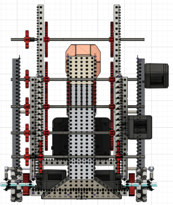
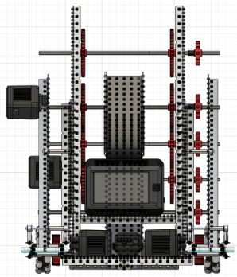
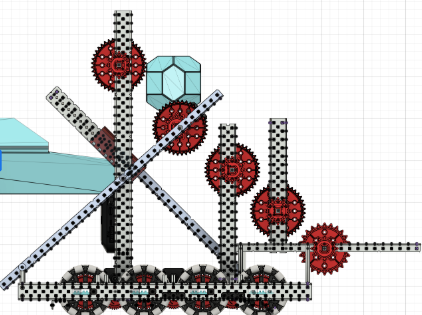
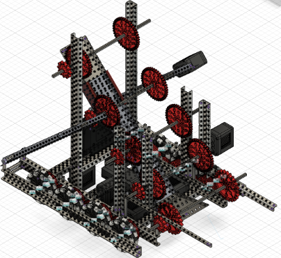
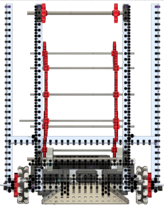
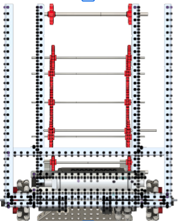
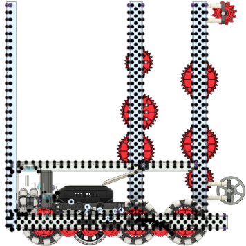
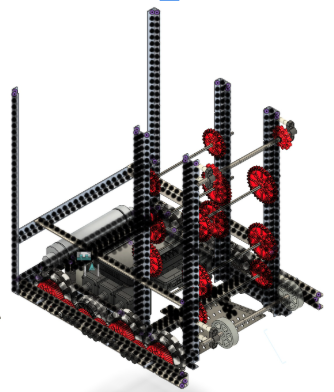

# Initial CADS (Computer Assisted Design)

Before building, our team decided to model the robot before building, something we learned at **Worlds** last year.

We've found it greatly improves clarity while building. A preconceived idea before building can greatly help efficiency and productivity.

This section catalogs each robot CAD design prototype with standardized specifications, views, and performance notes.  
Each design contributes unique insights toward developing the **final competition-ready robot**.

---

## CAD 1 — Brandon v1

| **Front View** | **Back View** |
|:---------------:|:--------------:|
|  |  |

| **Side View** | **Isometric View** |
|:--------------:|:------------------:|
|  |  |

### Specs
| Parameter | Value |
|------------|--------|
| **Drivetrain RPM** | 350 RPM |
| **Drivetrain Wheel Size** | 3.25" omni|
| **Bot Type** | Fast Cycle |
| **Capacity** | 6-7 blocks |
| **Motors Used** | 6×11W blue + 2x11W green|
| **Intake Type** | Rubber Band Barrel |

### Comments
- Drivetrain width suboptimal, too much unused space  
- Missing crossbraces and lacks structural integrity
- Use of high strength axles at the top may cause tipping due to higher center of gravity

---

## CAD 2 — Brandon v2

| **Front View** | **Back View** |
|:---------------:|:--------------:|
|  |  |

| **Side View** | **Isometric View** |
|:--------------:|:------------------:|
|  |  |

### Specs
| Parameter | Value |
|------------|--------|
| **Drivetrain RPM** | 350 RPM |
| **Drivetrain Wheel Size** | 3.25" traction |
| **Bot Type** | Hoard |
| **Capacity** | 9-10 |
| **Motors Used** | 6x11W blue, 22W unallocated |
| **Intake Type** | Flex Wheel |

### Comments
- One vertical odom pod
- Traction wheel spins at different speed than other wheels due to gear placement
- Sprocket placement doesn't allow for smooth ball movement
-

---

## CAD 3 — [Name v1]

*(Repeat the same structure as above.)*

---

## CAD 4 — [Name v1]

*(Repeat the same structure as above.)*

---

## CAD 5 — [Name v1]

*(Repeat the same structure as above.)*

---

# Culmination: Ideal Bot Features

After evaluating all five CAD prototypes, the **final competition-ready design** should combine the following traits:

| Category | Ideal Feature | Source CAD |
|-----------|----------------|-------------|
| **Drive Efficiency** | 3.25” omni wheels, 200–300 RPM for balance of speed and control | Brandon v1 |
| **Capacity & Speed** | Mid-capacity (8–10 blocks) for both endurance and agility | [CAD 2 or 3] |
| **Intake System** | Dual roller, tension-adjusted with rubber bands | Brandon v1 |
| **Frame Design** | Lightweight aluminum with reinforced base | [CAD 4] |
| **Control System** | Front-funnel alignment with vision assist | [CAD 5] |
| **Motor Setup** | 6 motors: 4 drivetrain, 2 intake + conveyor | Combined Concept |
| **Specialization** | Hybrid between Fast Cycle and Hoard for balanced strategy | Final Concept |

### Summary
- The **ideal bot** should strike a balance between **speed, stability, and block capacity**.  
- Incorporate **CAD-driven validation** before prototyping.  
- Maintain **modular component design** for easy tuning and mechanical adjustments.

---

> **Tip:** Keep all CAD files named consistently (`teamname_design_v#.step` or `.stl`) and store in `/cads/versions/` with linked test logs for easy iteration tracking.
